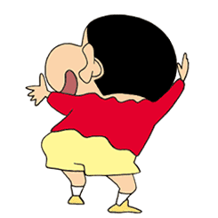

<!-- 动态打字效果: https://github.com/DenverCoder1/readme-typing-svg -->

  

<table>

<tr weight=100%><td>

## ✒️Welcome to ZJHAO

  
  

`“To see the world, things dangerous to come to, to see behind walls, to draw closer, to find each other and to feel. That is the purpose of life.”`

</td></tr>

<tr><td>
  

<!-- ## ⚽ 我的作品 -->

<!--  -->

</td></tr>

<tr><td>

</td></tr>

<tr><td>

## 👀Github 概况

<!-- Github概况: https://github.com/anuraghazra/github-readme-stats -->
    
<!-- 常用语言统计: https://github.com/anuraghazra/github-readme-stats -->
    

</td></tr>

</table>
<!-- 奖杯 

  

-->
